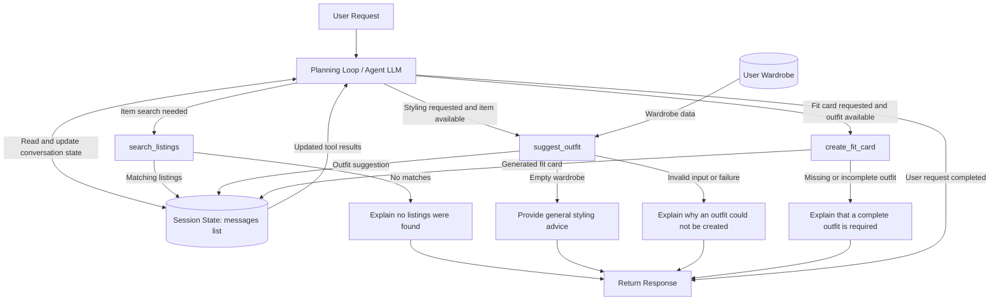

# FitFindr — planning.md

> Complete this document before writing any implementation code.
> Your spec and agent diagram are what you'll use to direct AI tools (Claude, Copilot, etc.) to generate your implementation — the more specific they are, the more useful the generated code will be.
> Your planning.md will be reviewed as part of your submission.
> Update it before starting any stretch features.

---

## Tools

List every tool your agent will use. For each tool, fill in all four fields.
You must have at least 3 tools. The three required tools are listed — add any additional tools below them.

### Tool 1: search_listings

**What it does:**
<!-- Describe what this tool does in 1–2 sentences -->
Searches the search_listings.json dataset for clothing items that match the user’s description, size, and maximum price. It returns the matching listings or a clear message when no matches are found.

**Input parameters:**
<!-- List each parameter, its type, and what it represents -->
- `description` (str): A description of the clothing item the user wants to find, such as "brown leather jacket".
- `size` (str): The required size of the clothing item, such as "M" or "32".
- `max_price` (float): The maximum amount the user is willing to pay for the item.

**What it returns:**
<!-- Describe the return value — what fields does a result contain? -->
Returns up to 3 matching clothing listings from the thrift listings dataset. Each result contains:
- id: Unique identifier for the listing
- description: Name or description of the item
- category: Clothing category
- colors: List of colors in the item
- style_tags: List of style descriptors
- size: Item size
- price: Item price
- condition: Condition of the item
- platform: Platform where the item is listed
- url: Link to the listing

**What happens if it fails or returns nothing:**
<!-- What should the agent do if no listings match? -->
If fewer than three matches are available, the tool returns all available matches. If no listings match the description, size, and maximum price, the tool returns an empty list. The agent explains that no matches were found and suggests changing one or more search requirements.
---

### Tool 2: suggest_outfit

**What it does:**
<!-- Describe what this tool does in 1–2 sentences -->
Uses a newly found clothing item and the user’s current wardrobe to suggest one or more complete outfit combinations. It selects wardrobe pieces that match the new item based on factors such as category, color, and style.

**Input parameters:**
<!-- List each parameter, its type, and what it represents -->
- `new_item` (dict): The specific clothing listing selected from search_listings. It contains information such as the item’s name, category, color, size, style, and price.
- `wardrobe` (dict): A list of clothing items the user already owns. Each dictionary represents one wardrobe item and may contain fields such as name, category, color, and style.

**What it returns:**
<!-- Describe the return value -->
Returns a str containing a complete outfit suggestion. The suggestion identifies the new item, wardrobe pieces that should be worn with it, and instructions for styling them together.
**What happens if it fails or returns nothing:**
<!-- What should the agent do if the wardrobe is empty or no outfit can be suggested? -->
If wardrobe["items"] is empty, the tool explains that it cannot create a personalized wardrobe-based outfit. It may recommend general types of clothing that would complement the new item, but it must not claim that the user owns those pieces.
If the wardrobe contains only a few compatible items, the tool creates the best possible outfit using the available clothes and explains that the choices are limited.
If the wardrobe has an invalid format or no usable outfit can be created, the tool returns a clear error message instead of crashing.
---

### Tool 3: create_fit_card

**What it does:**
<!-- Describe what this tool does in 1–2 sentences -->
Creates a short, shareable social-media caption based on a complete outfit suggestion and the newly thrifted item. The caption mentions important details such as the item, price, platform, outfit pieces, and overall style.

**Input parameters:**
<!-- List each parameter, its type, and what it represents -->
- `outfit` (str): The complete outfit suggestion returned by suggest_outfit, including the wardrobe pieces and instructions for how to wear them.
- `new_item` (dict): The selected thrift listing returned by search_listings, containing details such as the item’s description, price, size, platform, colors, and style tags.

**What it returns:**
<!-- Describe the return value -->
Returns a str containing a short, shareable outfit caption.

Example:

"thrifted this faded band tee from depop for $22 and it was made for my wide-leg jeans and combat boots 🖤"

The generated caption should change based on the provided outfit and new_item. Different items and outfit combinations should produce different captions.

**What happens if it fails or returns nothing:**
<!-- What should the agent do if the outfit data is incomplete? -->
If the outfit or new-item data is missing required information, the tool returns a clear error message identifying what information is missing instead of creating an inaccurate caption.

If only optional information, such as the platform or price, is unavailable, the tool creates a simpler caption using the available outfit information.

If no valid outfit is provided, the agent should not call create_fit_card. It should tell the user that a complete outfit must be created first.
---

### Additional Tools (if any)

<!-- Copy the block above for any tools beyond the required three -->

---

## Planning Loop

**How does your agent decide which tool to call next?**
<!-- Describe the logic your planning loop uses. What does it look at? What conditions change its behavior? How does it know when it's done? -->
The agent uses a planning loop that reviews the user’s request and the information already stored in the current session before choosing the next tool.

If the user wants to find an item, the agent calls `search_listings`. After the search, it checks whether any matching listings were returned. If no listings are found, it informs the user and may suggest changing the size, description, or maximum price instead of continuing.

If a valid item has been found and the user wants help styling it, the agent passes that item and the user’s wardrobe to `suggest_outfit`. If the wardrobe is empty or no complete outfit can be created, the agent explains the limitation and does not continue to the fit-card step.

If a valid outfit has been created and the user requests a shareable caption, the agent calls `create_fit_card` using the saved outfit and selected item.

The agent stops when the user’s request has been completed, when no additional tool is needed, or when an error or missing result prevents the workflow from continuing safely. It does not call all three tools automatically; each next action depends on the user’s goal and the result of the previous tool call.

---

## State Management

**How does information from one tool get passed to the next?**
The agent maintains state through the conversation’s messages list. Each user message, assistant tool call, and tool result is appended to the list. The updated message history is sent back to the model during every iteration of the planning loop.

After search_listings returns matching items, the result is added to messages as a tool message. The model can use that result to select an item and pass it into suggest_outfit without asking the user to enter the item again.

The outfit returned by suggest_outfit is also appended to messages. When the agent later calls create_fit_card, it can access both the selected listing and the outfit suggestion from the conversation history.

messages.append({
    "role": "tool",
    "tool_call_id": tool_call.id,
    "content": json.dumps(tool_result)
})

The agent sends the updated history back to the model:

response = client.chat.completions.create(
    model=MODEL,
    messages=messages,
    tools=TOOL_DEFINITIONS,
    tool_choice="auto"
)

The state tracked during the session includes:

The user’s original request and preferences
Listings returned by search_listings
The selected thrift item
The user’s wardrobe
The outfit returned by suggest_outfit
The fit card returned by create_fit_card
Errors or empty tool results

Because earlier tool results remain in messages, information can flow between tools during the same session. The agent checks the existing history before making another tool call so it does not unnecessarily repeat a successful call.

---

## Error Handling

For each tool, describe the specific failure mode you're handling and what the agent does in response.

| Tool | Failure mode | Agent response |
|------|-------------|----------------|
| search_listings | No results match the query | The agent tells the user that no matching listings were found and suggests changing the description, size, or maximum price. It does not continue to suggest_outfit or invent a listing.|
| suggest_outfit | Wardrobe is empty |The agent explains that there are no saved wardrobe items to build a complete outfit from. It provides a general styling suggestion for the new item and asks the user to add wardrobe pieces for a personalized outfit. |
| create_fit_card | Outfit input is missing or incomplete | The agent does not generate an inaccurate fit card. It explains that a complete outfit is required and either calls suggest_outfit first when enough information is available or tells the user what information is missing.|

---

## Architecture

<!-- Draw a diagram of your agent showing how the components connect:
     User input → Planning Loop → Tools (search_listings, suggest_outfit, create_fit_card)
                                                                          ↕
                                                                   State / Session
     Show what triggers each tool, how state flows between them, and where error paths branch off.
     Use ASCII art or a Mermaid diagram (https://mermaid.js.org/syntax/flowchart.html).
     Do NOT embed an image — graders need to read your diagram directly in the file;
     an embedded image or screenshot cannot be evaluated.
     You'll share this diagram with an AI tool when asking it to implement
     the planning loop and each individual tool. -->
     ## Architecture

## Architecture

### Flow summary

1. The user’s request is added to the `messages` list and sent to the planning loop.
2. The planning loop examines the user’s goal and previous tool results before choosing a tool.
3. `search_listings` uses Python filtering and keyword scoring to find up to three matching listings.
4. Matching listings are added to `messages`, where the agent can use one as the input to `suggest_outfit`.
5. `suggest_outfit` uses the selected listing and wardrobe data to generate an outfit suggestion through the Groq LLM.
6. The outfit suggestion is stored in `messages` and can be passed into `create_fit_card`.
7. `create_fit_card` uses the outfit and selected listing to generate a shareable caption through the Groq LLM.
8. If a tool fails or returns unusable information, the agent follows the appropriate error branch and responds without calling unnecessary tools.
9. The loop ends when the user’s request is complete or an error prevents it from continuing.

---

## AI Tool Plan

<!-- For each part of the implementation below, describe:
     - Which AI tool you plan to use (Claude, Copilot, ChatGPT, etc.)
     - What you'll give it as input (which sections of this planning.md, your agent diagram)
     - What you expect it to produce
     - How you'll verify the output matches your spec before moving on

     "I'll use AI to help me code" is not a plan.
     "I'll give Claude my Tool 1 spec (inputs, return value, failure mode) and ask it to implement
     search_listings() using load_listings() from the data loader — then test it against 3 queries
     before trusting it" is a plan. -->

## AI Tool Plan

**Milestone 3 — Individual tool implementations:**

I will use ChatGPT to help implement the three functions in `tools.py`. For each function, I will provide the matching tool section from `planning.md`, the starter-code function signature and TODO comments, and any required data schema.

For `search_listings`, I will provide the Tool 1 specification and the listing fields documented in the starter code. I will ask ChatGPT to implement the function using `load_listings()`, including optional size and maximum-price filtering, keyword-overlap scoring, relevance sorting, and a limit of three results.

I will verify that the generated code:

* Uses `load_listings()` rather than hardcoded data
* Handles `size=None` and `max_price=None`
* Matches sizes case-insensitively
* Excludes listings with no keyword overlap
* Sorts the strongest matches first
* Returns no more than three listings
* Returns an empty list when nothing matches

I will test it with a normal query, a restrictive size-and-price query, and a query that should return no results.

For `suggest_outfit`, I will provide the Tool 2 specification, the wardrobe schema, the example wardrobe, the empty wardrobe, and the starter-code TODO comments. I will ask ChatGPT to generate code that validates the inputs, formats the selected listing and wardrobe items into an LLM prompt, calls Groq, and returns one or two complete outfit suggestions.

I will verify that the generated code:

* Reads clothing items from `wardrobe["items"]`
* Includes the selected thrift item in every suggested outfit
* Refers only to wardrobe pieces the user actually owns
* Returns general styling guidance when the wardrobe is empty
* Does not pretend suggested general pieces are already owned
* Returns a non-empty string or a descriptive error message

I will test it with the example wardrobe, a minimal wardrobe, an empty wardrobe, and invalid wardrobe data.

For `create_fit_card`, I will provide the Tool 3 specification, the starter-code TODO comments, a sample listing, and a sample outfit result. I will ask ChatGPT to implement an empty-outfit check, build a prompt using the outfit and listing details, call the Groq LLM with a higher temperature, and return a two-to-four-sentence social-media caption.

I will verify that the generated code:

* Handles an empty or whitespace-only outfit without crashing
* Uses the item title, price, and platform
* Produces a casual OOTD-style caption
* Mentions the outfit’s specific style or vibe
* Returns a string
* Produces captions that reflect different inputs

I will test it with at least two different items and outfits, followed by an empty outfit input.

---

**Milestone 4 — Planning loop and state management:**

I will use ChatGPT to help implement the planning loop in `agent.py`. I will provide the Planning Loop section, State Management section, Error Handling table, Architecture diagram, all three tool interfaces, and the starter `agent.py` code.

I will ask ChatGPT to generate a loop that:

* Adds the user request to the `messages` list
* Sends the messages and tool definitions to the Groq model
* Appends the assistant’s tool-call message to the history
* Executes only the tool calls from the newest model response
* Appends each tool result as a tool message
* Sends the updated history back to the model
* Continues until the model returns a normal final response
* Stops safely after a maximum number of tool rounds
* Converts tool exceptions into clear error results instead of crashing

I will compare the generated code with the Architecture diagram and confirm that the model chooses tools based on the user’s request and previous results rather than calling all three tools in a fixed order.

I will test these workflows:

1. A request that needs only `search_listings`
2. A request that needs `search_listings` and `suggest_outfit`
3. A complete request that uses all three tools
4. A search with no matching listings
5. An outfit request with an empty wardrobe
6. A fit-card request with missing outfit data
7. A stress test to confirm the maximum tool-round limit works

During testing, I will print or log each tool name, its arguments, and its returned result. I will not use the generated planning loop until the observed tool order, state flow, stopping behavior, and error handling match the specifications in `planning.md`.

---

## A Complete Interaction (Step by Step)

Write out what a full user interaction looks like from start to finish — tool call by tool call. Use a specific example query.

**Example user query:** "I'm looking for a vintage graphic tee under $30. I mostly wear baggy jeans and chunky sneakers. What's out there and how would I style it?"

**Step 1:**
<!-- What does the agent do first? Which tool is called? With what input? -->
Step 1:
The agent sees that the user wants to find a clothing item. It calls:

search_listings(
    description="vintage graphic tee",
    size=None,
    max_price=30.0
)

The tool searches the listings data and returns up to three matching items.

**Step 2:**
<!-- What happens next? What was returned from step 1? What tool is called now? -->
The agent sees that the user also wants styling help. It chooses the best matching listing and calls:

suggest_outfit(
    new_item=selected_listing,
    wardrobe=example_wardrobe
)

The tool sends the selected item and wardrobe information to the Groq LLM.

**Step 3:**
<!-- Continue until the full interaction is complete -->
The agent checks the original request. The user asked for listings and styling help, but did not ask for a fit card.
The agent does not call create_fit_card. It stops because the request is complete.

**Final output to user:**
<!-- What does the user actually see at the end? -->
I found two vintage graphic tees under $30:

1. Faded vintage band graphic tee — $22 on Depop, size M
2. Oversized retro graphic T-shirt — $28 on Poshmark, size L

The faded band tee is the best match. Pair it with your dark-wash
baggy jeans and chunky white sneakers. Slightly tuck in the front
and add your black crossbody bag for a relaxed vintage streetwear look.
